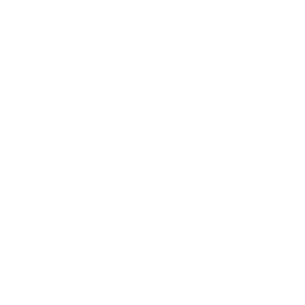

# 📚 Prática de Programação Orientada a Objetos 

Exércicios prático da disciplina de Programação Orientada a Objetos do curso de Sistemas de Informação da Universidade Federal de Lavras

## Tecnologias:

